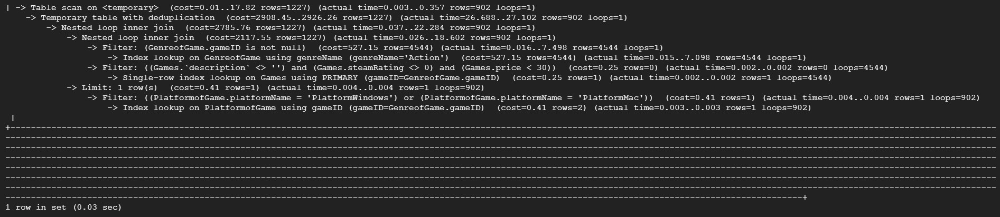

## GCP Connection

## DDL
CREATE TABLE Users(username varchar(255) primary key, password varchar(255));

CREATE TABLE Games(gameID int primary key, name varchar(255), description text(65535), steamRating int, price int, website varchar(255));

CREATE TABLE Platform(platformName varchar(255) primary key);

CREATE TABLE Genre(genreName varchar(255) primary key);

CREATE TABLE Ratings(username varchar(255), gameID int, rating int, foreign key (username) references Users(username) on delete cascade on update cascade, foreign key (gameID) references Games(gameID) on delete cascade on update cascade);

CREATE TABLE Friends(username varchar(255), friendname varchar(255), foreign key (username) references Users(username) on delete cascade on update cascade, foreign key (friendname) references Users(username) on delete cascade on update cascade);

CREATE TABLE GenreofGame(gameID int, genreName varchar(255), foreign key (gameID) references Games(gameID) on delete cascade on update cascade, foreign key (genreName) references Genre(genreName) on delete cascade on update cascade);

CREATE TABLE PlatformofGame(gameID int, platformName varchar(255), foreign key (gameID) references Games(gameID) on delete cascade on update cascade, foreign key (platformName) references Platform(platformName) on delete cascade on update cascade);

CREATE TABLE SearchHistory(searchID int, username varchar(255), gameID int, primary key (searchID, username), foreign key (username) references Users(username) on delete cascade on update cascade);

## Data Count

## Advanced Queries
### Query 1:
SELECT genreName, AVG(steamRating) as AvgRating, AVG(price) as AvgPrice, COUNT(gameID) as gameNum
FROM Games NATURAL JOIN GenreofGame
WHERE website <> "None"
GROUP BY genreName
LIMIT 15;

#### Result:

This query finds the average rating and price, and the total number of games in each genre, and we add the constraint (website <> "None") to ensure that each game record is valid.

### Query 2:
SELECT DISTINCT name, description, steamRating, price
FROM PlatformofGame NATURAL JOIN (SELECT * FROM Games NATURAL JOIN GenreofGame WHERE genreName = "Action" AND description <> "" AND steamRating <> 0 AND price < 30) as temp
WHERE platformName = "PlatformWindows" OR platformName = "PlatformMac"
LIMIT 15;

#### Result:

This query first uses a subquery to find all "Action" games and we add a constraint that the description and rating are not empty, and the price is lower than 30. Then, it finds out the games that are supported by PlatformWindows and PlatformMac.

## Indexing Analysis
### Query 1

EXPLAIN ANALYZE SELECT genreName, AVG(steamRating) as AvgRating, AVG(price) as AvgPrice, COUNT(gameID) as gameNum FROM Games NATURAL JOIN GenreofGame WHERE website <> "None" GROUP BY genreName;

#### Only default index (gameID, genereName):

#### Default index + steamRating_idx:
CREATE INDEX steamRating_idx ON Games(steamRating);

Since we need to compute the AVG(steamRating), we add an index steamRating_idx. We can find that the actual time for Aggregate using temporary table lower from 97.344..97.347 to 95.771..95.774, the actual time for Nested loop inner join lower from 0.073..65.711 to 0.038..64.881, and the actual time for filter also lower.

#### Default index + steamRating_idx + price_idx:
CREATE INDEX price_idx ON Games(price);

Since we need to compute the AVG(price), we add an index price_idx. We can find that the actual time for Aggregate using temporary table lower from 95.771..95.774 to 93.982..93.986, and the overall execution time lower from 0.10 sec to 0.09 sec.

#### Default index + steamRating_idx + price_idx + website_idx:
CREATE INDEX website_idx ON Games(website(10));

Since we need to filter (website <> "None"), we add an index website_idx. We can find that the cost, rows, actual time for Nested loop inner join lower from 16818.70, 33589, 63.479 to 8967.78, 21685, 57.191 because "website" is in the WHERE clause to filter records and we'll have less rows and cost on this step after we add the website_idx. And the actual time for Aggregate using temporary table lower from 93.982..93.986 to 88.071..88.075. In conclusion, adding the above three indexes help improve the overall performance by 0.01 seconds.

### Query 2

EXPLAIN ANALYZE SELECT DISTINCT name, description, steamRating, price FROM PlatformofGame NATURAL JOIN (SELECT * FROM Games NATURAL JOIN GenreofGame WHERE genreName = "Action" AND description <> "" AND steamRating <> 0 AND price < 30) as temp WHERE platformName = "PlatformWindows" OR platformName = "PlatformMac";

#### Only default index (gameID, genereName, platformName):

#### Default index + steamRating_idx:
CREATE INDEX steamRating_idx ON Games(steamRating);

// TODO

#### Default index + steamRating_idx + price_idx:
CREATE INDEX price_idx ON Games(price);

Since we need to compute the AVG(price), we add an index price_idx. We can find that the actual time for Aggregate using temporary table lower from 32.946...33.313 to 27.486...27.841, and the overall execution time stays the same for 0.03 sec.

#### Default index + steamRating_idx + price_idx + descrip_idx:
CREATE INDEX descrip_idx ON Games(description(10));

// TODO
