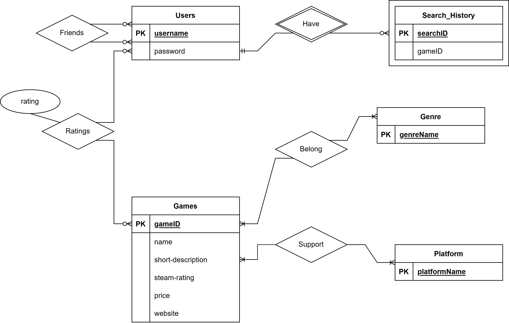

## ERD

## Assumptions

### Information about the tables themselves:
The database includes a description of Users, which are uniquely identified by their usernames, but we also keep track of their passwords.  The data includes a Search History, which is uniquely identified by searchId and has gameID. The database includes a description of Games, where each game is uniquely identified by its gameID, and also has a name, short-description, steam-rating, price, and website as its other attributes.  Each game is tied to a Genre, which has genreName as a unique attribute. Finally, each game is also supported by Platforms, with platformName as a unique attribute.

### Information about the relationships between the tables:
Users each have a search history, but each search history can only have one corresponding user. Each user can rate multiple games, and each game can be rated by multiple users, with each user’s rating being stored. Each user can connect with other users as friends, and a user can have zero to many friended users. Games belong to genres and can have one or more. Genres can also have one or more games encompassed by them (we consider a genre to be a genre only if there is at least one game of that genre). Games can be supported by many platforms but must be supported by at least one, and a platform can support many games but must support at least one to be a valid platform.

### Relational Schema:
Users(username: varchar(255) [PK], password: varchar(255))

Games(gameID: int [PK], name: varchar(255), description: text(65535), steamRating: int, price: int, website: varchar(255))

Platform(platformName: varchar(255) [PK])

Genre(genreName: varchar(255) [PK])

Ratings(username: varchar(255) [FK to Users.username], gameID: int [FK to Games.gameID], rating: int)

Friends(username: varchar(255) [FK to Users.username], friendname: varchar(255) [FK to Users.username])

GenreofGame(gameID: int [FK to Games.gameID], genreName: varchar(255) [FK to Genre.genreName])

PlatformofGame(gameID: int [FK to Games.gameID], platformName: varchar(255) [FK to Platform.platformName])

SearchHistory(searchID: int [PK], username: varchar(255) [FK to Users.username], gameID: int)

## DDL Commands:

CREATE TABLE Users(username varchar(255) primary key, password varchar(255));

CREATE TABLE Games(gameID int primary key, name varchar(255), description text(65535), steamRating int, price int, website varchar(255));

CREATE TABLE Platform(platformName varchar(255) primary key);

CREATE TABLE Genre(genreName varchar(255) primary key);

CREATE TABLE Ratings(username varchar(255), gameID int, rating int, foreign key (username) references Users(username) on delete cascade on update cascade, foreign key (gameID) references Games(gameID) on delete cascade on update cascade);

CREATE TABLE Friends(username varchar(255), friendname varchar(255), foreign key (username) references Users(username) on delete cascade on update cascade, foreign key (friendname) references Users(username) on delete cascade on update cascade);

CREATE TABLE GenreofGame(gameID int, genreName varchar(255), foreign key (gameID) references Games(gameID) on delete cascade on update cascade, foreign key (genreName) references Genre(genreName) on delete cascade on update cascade);

CREATE TABLE PlatformofGame(gameID int, platformName varchar(255), foreign key (gameID) references Games(gameID) on delete cascade on update cascade, foreign key (platformName) references Platform(platformName) on delete cascade on update cascade);

CREATE TABLE SearchHistory(searchID int, username varchar(255), gameID int, primary key (searchID, username), foreign key (username) references Users(username) on delete cascade on update cascade);

