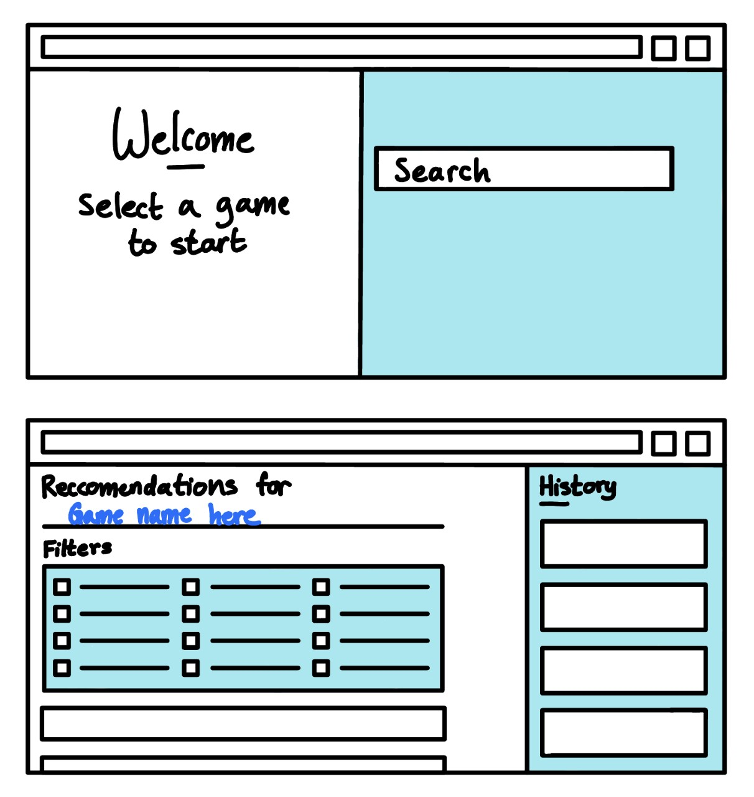

# Steam Game Recommendation Engine

## Project Summary
The Steam Game Recommendation Engine is a web application that aims to streamline the process of finding games that are very specifically similar to a game that the user has heard of or played before. The user first will select or enter a game available on the platform to use as a base for their search. The application will output similar games based on the attributes of their entered game. Alternatively, users can also find games based on the filters including (but not limited to) genre, PC compatibility, multiplayer functionality, critic ratings, age, and price. For all games suggested to the user, the application will link these games using the information in the database.

The user will be able to login using Google authentication (their email), and all recent searches and games resulting from these searches will be stored in the user’s history. Lastly, the application will suggest users with the same game suggestions to encourage them to find other gamers with similar interests in games on Steam.

## Description

We want both incoming and experienced gamers to be able to find games that suit their preferences when they search for games similar to ones they have heard of or played already. Diving headfirst into finding good games can be very grueling and disorienting, and put people off gaming entirely, and experienced players know the frustration of finding a game like a specific one they played before. We want to simplify the process of finding games in this fashion to make the difficulty curve lower, and to help players avoid wasting their time and money playing games they are not interested in. In addition, we wanted people to find other random users to connect with and build relationships with, as it is hard to find lasting connections on a lot of games without knowing the person beforehand. 

## Usefulness

Our application is useful for finding games similar to games that a user knows about or based on genre, producer, spec-requirements, and ratings. It is also useful for finding new people to play a variety of games with. The most similar application existing already would be Steam’s own recommendation engine; however it is heavily tailored to a user’s previous game data, and does not necessarily recommend games similar to one in particular, which is what we are aiming to implement. 

## Realness

We decided to use Steam Game Data from data.world (https://data.world/craigkelly/steam-game-data), which was listed as one of the recommended datasets on the Project Track 1 Dataset. Our data set is composed of real game data that is publicly available via the Steam API, and contains various bits of information about the games on the platform, including genre, multiplayer compatibility, critic rating, and computer requirements.

## Functionality

The most basic function of our web application is entering a game from the database in the search bar. With this search, we can retrieve the attributes of the game and find a list of similar games from the data in the database. We will also have a way to find similar games based on a list of attributes that the user can select, in case the user is not looking for a game that is similar to a particular game. For example, the user would be able to sort through a list of requirements, including PC compatibility, genres, price, etc. and can be given a list of games that fit their requirements.

On a more complex level, we will have users enter username and password to log in. With this, we aim to store recent searches for each user locally. To do this, we will have to store recent searches in a new table of our choosing. For insertion interface, we will allow users to add games into the database; For deletion interface, users can delete their searches from their search history; For updating interface, we will allow users to edit the game info in the existing game entries (like fixing bug info). The most complex feature we aim to complete is connecting the user with other people who have similar game interests. Lastly, on the most general level, we want to host our web application through googledomains.com.

Low-Fidelity UI Mockup:

## Project Work Distribution

Minghua: Integrate user register, login, logout, aid in building infrastructure of front-end/flush out details, find similarities between users and display users

Nisha: Create table to store history for each user, find way to host backend, help with frontend as needed

Siya: Queries to find games based on filters, queries to find games based on inputted games, outputting links for suggested games, adding suggested games to history database table built by Nisha, help with frontend as needed

Xiaofan: Building out the infrastructure of the front-end/continue to develop the web app, host the website on a custom url, find similarities between users and display users

